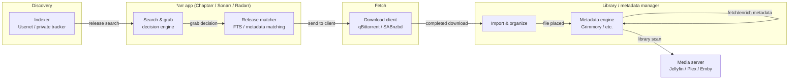

# *arr / media-management pipeline — generic architecture

This is the **generic shape** of the acquisition → library-management
pipeline these tools implement, not a diagram of any specific deployment.
No hosts, IPs, ports, or instance counts — just how the pieces relate,
useful context for following the bug writeups in `digest/` (several of
them are specifically about the handoff between these components).

## Where the filed bugs sit in this flow

| Bug | Where it happens |
|---|---|
| [Duplicate-row import hijack](../digest/chaptarr/duplicate-row-import-hijack.md) | Release matcher — a book gets matched to the wrong DB row, so import is rejected and the grab loops |
| [MAM snatch_summary nesting](../digest/chaptarr/mam-snatch-summary-nesting.md) | Search & grab decision engine — reads indexer account status wrong, so grabs get refused even though search still works |
| [Grimmory cover-upload 500](../digest/grimmory/cover-upload-folder-audiobooks.md) | Import → metadata engine handoff — the *arr app hands off correctly, the metadata engine's write path fails for one file layout |
| [Folder-duration 2x](../digest/grimmory/duration-recorded-2x.md) | Metadata engine only — a read-side bug in how duration is calculated for certain audio formats, unrelated to the *arr app |

Most bugs found so far cluster around the **matcher** and the **import →
metadata-engine handoff** — the two places where two independently-built
systems have to agree on what a "book" is.
